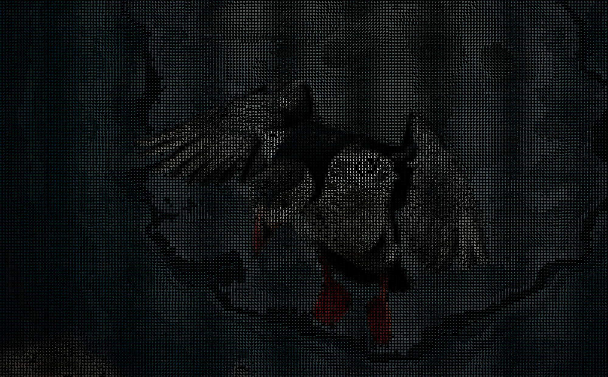
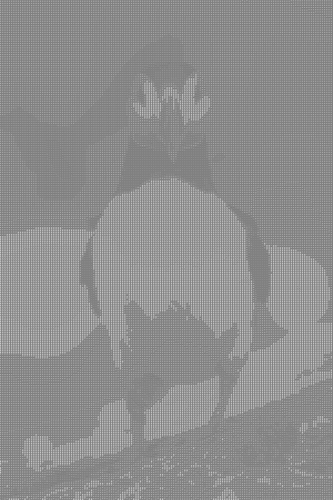
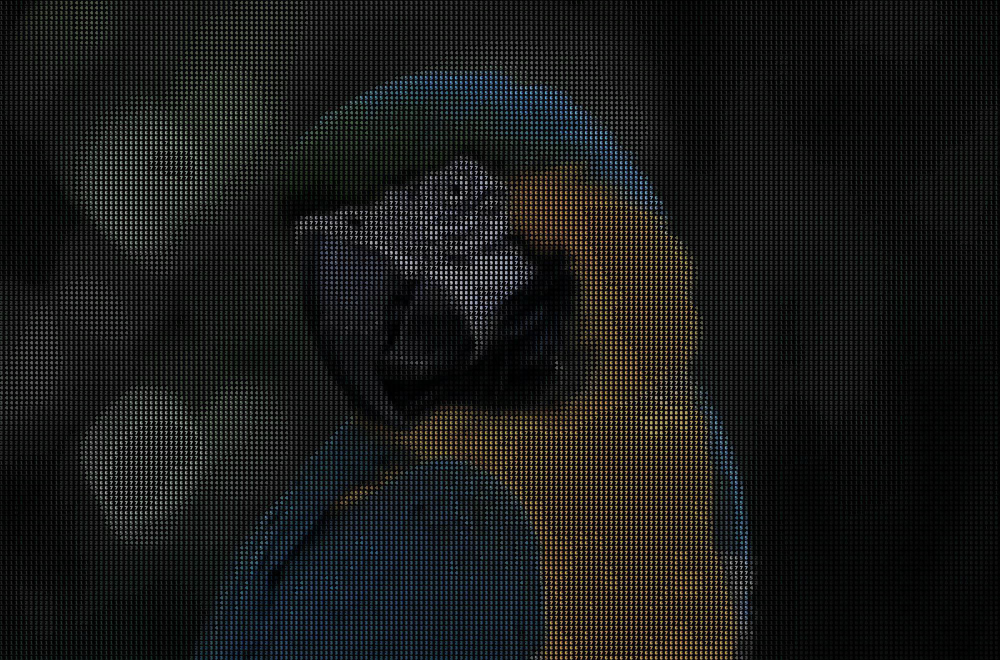

## Asciify
Program that allows you to convert image to ascii art.
you can save it in txt file or in png format, in color or not.


## Usage
```bash
python3 asciify.py image_name.png -h
```
```bash
asciify.py [-h] [-w WIDTH] [-i] [-c] [-bc BACKGROUND_COLOR] [-s SYMBOLS_LIST] image_path
```
### positional arguments:
```
  image_path            Path of image to be transformed into ascii art.
```

### optional arguments:
```
  -h, --help            show this help message and exit
  -w WIDTH, --width WIDTH
                        Insert desired amount of pixels on width|width resolution = input_width*10
  -i, --image           Choose IMAGE mode else TXT mode
  -c, --color           Ascii art in IMAGE mode will have colors
  -bc BACKGROUND_COLOR, --background_color BACKGROUND_COLOR
                        Insert desired background color
  -s SYMBOLS_LIST, --symbols_list SYMBOLS_LIST
                        Insert symbols_list which will be used in ascii art

```

### Example:
```bash
python3 python3 asciify.py bird.jpg -i -c -w 200
```


```bash
python3 asciify.py puffin.jpg -i -s  .:-=+*#%@ -w 150 -bc grey
```


```bash
python3 asciify.py parrot.jpg -i -c -s 0123456789 -w 200
```


### links to photos:
https://unsplash.com/photos/roswbY5tHH8

https://unsplash.com/photos/x6_VdEkH3NQ

https://unsplash.com/photos/mpw37yXc_WQ

https://unsplash.com/photos/VdW5_6Q5eFY